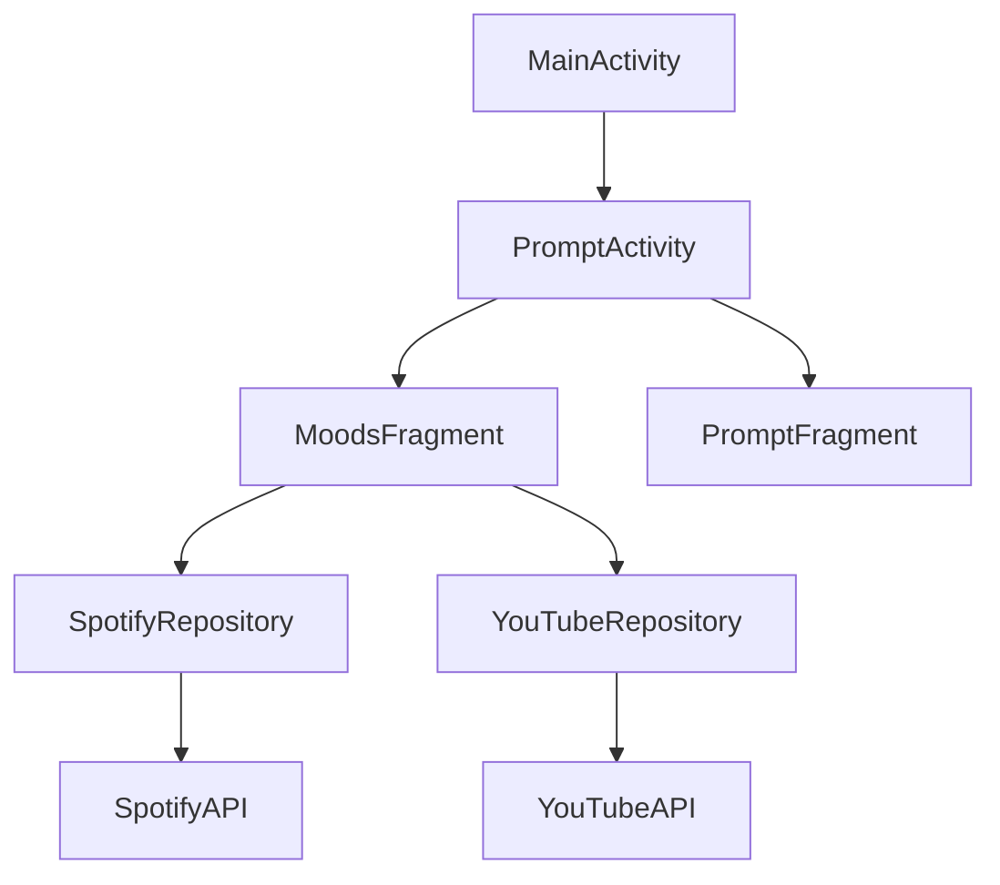

# Software Design Specification
## Cheerly - A Mood Uplift App
Version 1.2  
Last Updated: November 1, 2024

## Table of Contents
1. [Architecture Overview](#1-architecture-overview)
2. [System Design](#2-system-design)
3. [Component Design](#3-component-design)
4. [Database Design](#4-database-design)
5. [Interface Design](#5-interface-design)
6. [Algorithm Design](#6-algorithm-design)
7. [Security Design](#7-security-design)

## 1. Architecture Overview

### 1.1 High-Level Architecture

#### 1.1.1 System Architecture Diagram
```plaintext
┌─────────────────────────────────────────────┐
│                Mobile Client                │
├─────────────────┬─────────────┬─────────────┤
│   UI Layer      │  Business   │    Data     │
│ (Activities &   │   Logic     │   Layer     │
│   Fragments)    │   Layer     │             │
├─────────────────┴─────────────┴─────────────┤
│           External Service Layer            │
│      (Spotify API, YouTube API, etc.)       │
└─────────────────────────────────────────────┘
```

### 1.2 Design Patterns

#### 1.2.1 MVVM Architecture
```kotlin
// ViewModel Pattern
class SubscriptionViewModel : ViewModel() {
    private val _subscriptionState = MutableLiveData<SubscriptionState>()
    val subscriptionState: LiveData<SubscriptionState> = _subscriptionState
    
    fun processSubscription(context: Context) {
        viewModelScope.launch {
            _subscriptionState.value = SubscriptionState.Loading
            // Implementation
        }
    }
}
```

#### 1.2.2 Repository Pattern
```kotlin
class SpotifyRepository {
    private val apiService: SpotifyApiService
    private var accessToken: String? = null

    suspend fun getRecommendations(mood: String): List<Track> {
        // Implementation
    }
}
```

#### 1.2.3 Singleton Pattern
```kotlin
class PremiumManager private constructor(context: Context) {
    companion object {
        @Volatile
        private var instance: PremiumManager? = null
        
        fun getInstance(context: Context): PremiumManager {
            return instance ?: synchronized(this) {
                instance ?: PremiumManager(context).also { instance = it }
            }
        }
    }
}
```

## 2. System Design

### 2.1 System Components

#### 2.1.1 Core Components
```plaintext
├── Activities
│   ├── MainActivity
│   ├── SplashActivity
│   ├── UserPreference
│   └── PromptActivity
├── Fragments
│   ├── MoodsFragment
│   └── PromptFragment
├── ViewModels
│   └── SubscriptionViewModel
└── Repositories
    ├── SpotifyRepository
    └── YouTubeRepository
```

### 2.2 Component Dependencies



## 3. Component Design

### 3.1 Activity Implementations

#### 3.1.1 MainActivity
```kotlin
class MainActivity : ComponentActivity() {
    override fun onCreate(savedInstanceState: Bundle?) {
        // Check user preferences
        // Route to appropriate activity
    }
}
```

#### 3.1.2 PromptActivity
```kotlin
class PromptActivity : FragmentActivity() {
    private fun loadFragment(fragment: Fragment)
    private fun updateUI(fragment: Fragment, selectedButton: Button, unselectedButton: Button)
}
```

### 3.2 Repository Implementations

#### 3.2.1 SpotifyRepository
```kotlin
class SpotifyRepository {
    private val CLIENT_ID = "..."
    private val CLIENT_SECRET = "..."
    
    suspend fun getRecommendations(mood: String): List<Track>
    private suspend fun getAccessToken(): String
}
```

### 3.3 ViewModels

#### 3.3.1 SubscriptionViewModel
```kotlin
class SubscriptionViewModel : ViewModel() {
    fun processSubscription(context: Context)
    private fun handlePaymentSuccess()
    private fun handlePaymentError(error: Exception)
}
```

## 4. Database Design

### 4.1 SharedPreferences Schema
```kotlin
object PreferenceKeys {
    const val USER_PREFERENCES = "AppPrefs"
    const val PREMIUM_STATUS = "isPremium"
    const val PREMIUM_EXPIRY = "premiumExpiry"
    const val SELECTED_MUSIC = "selectedMusicOptions"
    const val SELECTED_VIDEOS = "selectedVideoOptions"
    const val SELECTED_PODCASTS = "selectedPodcastOptions"
    const val SELECTED_ACTIVITIES = "selectedActivityOptions"
}
```

### 4.2 Data Models

#### 4.2.1 Content Models
```kotlin
data class Track(
    val id: String,
    val name: String,
    val artists: List<Artist>,
    val album: Album,
    val external_urls: ExternalUrls
)

data class Video(
    val id: String,
    val title: String,
    val channelName: String,
    val thumbnailUrl: String,
    val videoUrl: String
)
```

## 5. Interface Design

### 5.1 API Interfaces

#### 5.1.1 Spotify Service
```kotlin
interface SpotifyApiService {
    @GET("recommendations")
    suspend fun getRecommendations(
        @Header("Authorization") auth: String,
        @Query("seed_genres") seedGenres: String,
        @Query("target_valence") targetValence: Float,
        @Query("target_energy") targetEnergy: Float
    ): Response<SpotifyRecommendationsResponse>
}
```

#### 5.1.2 YouTube Service
```kotlin
interface YouTubeService {
    @GET("youtube/v3/search")
    suspend fun searchVideos(
        @Query("part") part: String,
        @Query("maxResults") maxResults: Int,
        @Query("q") query: String,
        @Query("type") type: String,
        @Query("key") apiKey: String
    ): Response<YouTubeSearchResponse>
}
```

### 5.2 UI Components

#### 5.2.1 Mood Selection
```xml
<LinearLayout
    android:id="@+id/buttonContainer"
    android:layout_width="match_parent"
    android:layout_height="wrap_content"
    android:orientation="horizontal">

    <Button
        android:id="@+id/btnMoods"
        android:layout_width="0dp"
        android:layout_height="wrap_content"
        android:layout_weight="1"
        android:text="Moods" />

    <Button
        android:id="@+id/btnPrompt"
        android:layout_width="0dp"
        android:layout_height="wrap_content"
        android:layout_weight="1"
        android:text="Prompt" />
</LinearLayout>
```

## 6. Algorithm Design

### 6.1 Mood-Based Recommendation Algorithm

```kotlin
fun getMoodParameters(mood: String): RecommendationParams {
    return when (mood.lowercase()) {
        "happy" -> RecommendationParams(
            valence = 0.8f,
            energy = 0.7f,
            genres = "pop,happy"
        )
        "sad" -> RecommendationParams(
            valence = 0.2f,
            energy = 0.3f,
            genres = "acoustic,sad"
        )
        "excited" -> RecommendationParams(
            valence = 0.6f,
            energy = 0.9f,
            genres = "dance,party"
        )
        "relaxed" -> RecommendationParams(
            valence = 0.5f,
            energy = 0.2f,
            genres = "ambient,chill"
        )
        else -> RecommendationParams(
            valence = 0.5f,
            energy = 0.5f,
            genres = "pop"
        )
    }
}
```

### 6.2 Content Filtering Algorithm

```kotlin
fun filterContent(content: List<Media>, userPreferences: UserPreferences): List<Media> {
    return content
        .filter { it.genre in userPreferences.genres }
        .filter { it.type in userPreferences.contentTypes }
        .sortedByDescending { it.relevanceScore }
        .take(10)
}
```

## 7. Security Design

### 7.1 API Authentication
```kotlin
class APIAuthenticator {
    private val keyStore: KeyStore
    private var accessToken: String? = null
    
    fun getAuthToken(): String {
        // Token management logic
    }
    
    fun refreshToken() {
        // Token refresh logic
    }
}
```

### 7.2 Premium Status Verification
```kotlin
class PremiumVerifier {
    fun verifyPremiumStatus(context: Context): Boolean {
        val premiumManager = PremiumManager(context)
        return premiumManager.isPremiumUser() && 
               !premiumManager.isSubscriptionExpired()
    }
}
```

### 7.3 Secure Storage
```kotlin
class SecurePreferences {
    private val encryptedSharedPrefs: SharedPreferences
    
    fun storeSecurely(key: String, value: String) {
        // Encrypted storage logic
    }
    
    fun retrieveSecurely(key: String): String? {
        // Encrypted retrieval logic
    }
}
```

## 8. Error Handling

### 8.1 API Error Handling
```kotlin
sealed class Result<out T> {
    data class Success<T>(val data: T) : Result<T>()
    data class Error(val exception: Exception) : Result<Nothing>()
    object Loading : Result<Nothing>()
}

fun handleApiError(error: Exception): Result<Nothing> {
    return when (error) {
        is IOException -> Result.Error(NetworkError())
        is HttpException -> Result.Error(APIError(error.code()))
        else -> Result.Error(UnknownError())
    }
}
```

## 9. Performance Optimization

### 9.1 Content Caching
```kotlin
class ContentCache {
    private val memoryCache: LruCache<String, Media>
    private val diskCache: DiskLruCache
    
    fun cacheContent(key: String, content: Media)
    fun retrieveContent(key: String): Media?
}
```

### 9.2 Image Loading
```kotlin
fun loadImage(imageView: ImageView, url: String) {
    imageView.load(url) {
        crossfade(true)
        placeholder(R.drawable.placeholder_image)
        error(R.drawable.error_image)
    }
}
```

## 10. Testing Strategy

### 10.1 Unit Tests
```kotlin
class SpotifyRepositoryTest {
    @Test
    fun `test recommendation parameters for happy mood`()
    
    @Test
    fun `test error handling for API failure`()
}
```

### 10.2 UI Tests
```kotlin
class MoodSelectionTest {
    @Test
    fun testMoodSelection()
    
    @Test
    fun testCustomMoodInput()
}
```

## 11. Deployment Strategy

### 11.1 Release Process
1. Version increment
2. ProGuard configuration
3. Signing configuration
4. Play Store deployment

### 11.2 Build Configuration
```gradle
android {
    buildTypes {
        release {
            minifyEnabled true
            proguardFiles getDefaultProguardFile('proguard-android.txt')
        }
    }
}
```

## Appendices

### A. Third-Party Libraries
- Retrofit for API calls
- Coil for image loading
- Material Design components

### B. API Documentation
- Spotify Web API
- YouTube Data API v3

### C. Version History
| Version | Date | Changes |
|---------|------|---------|
| 1.0 | 2024-10-01 | Initial design |
| 1.1 | 2024-10-15 | Added premium features |
| 1.2 | 2024-11-01 | Updated API integration |