# SPLASH - 6 - Assignment 2:   Mid-term Interim Progress Report
## Cheerly - A Mood Uplift App: Learning & Implementation Journey
 
**Course**: COMP-8117 Applied Software Engineering  
**Instructor**: Dr. Aznam YACOUB  
**Date**: November 1, 2024

**Team Members**:
- Rajkumar Patel - Team Lead
- Vansh Patel
- Ridham Patel
- Divya Mistry

---
## Table of Contents
1. [Project Context](#project-context)
2. [Artifacts Produced](#1-artifacts-produced)
3. [Initial Objectives & Schedule](#2-initial-objectives-and-schedule)
4. [Progress Analysis](#3-progress-analysis)
5. [Strategy for Remaining Work](#4-strategy-for-remaining-work)
6. [Management Documentation](#5-management-documentation)
7. [Financial Analysis](#6-financial-analysis)
8. [Success and Challenges](#7-success-and-challenges)
9. [Redefined Priorities](#8-redefined-priorities)
10. [Lessons Learned](#9-lessons-learned)

---

## Project Context
Cheerly is an Android application being developed as part of the COMP-8117 Applied Software Engineering course. The project addresses the challenge of fragmented content discovery by creating a unified, mood-based recommendation system. This interim report documents our progress after 1.5 months of development, analyzing our implementation of industry-standard software engineering practices and learning outcomes.

## 1. Artifacts Produced

### 1. Application Stability Analysis
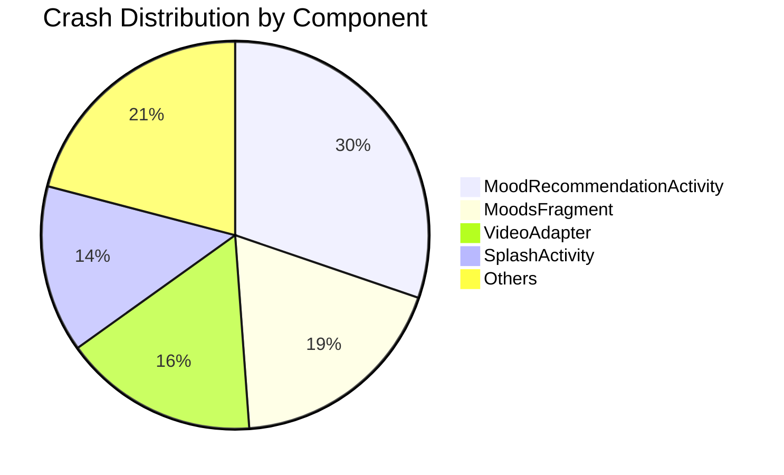

### Stability Metrics
| Metric | Value | Status |
|--------|--------|--------|
| Crash-free Users | 65.71% | 🟡 Needs Improvement |
| Crash-free Sessions | 74.71% | 🟡 Needs Improvement |
| Total Crashes | 43 | 🔴 High |
| Affected Users | 12 | 🟡 Moderate |

### 2. CI/CD Performance
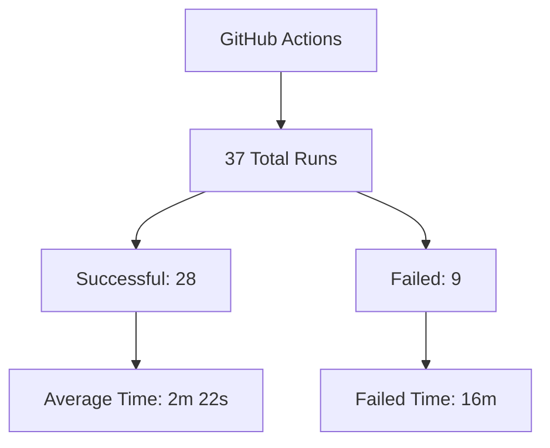

### Build Performance Analysis
| Metric | Value | Context |
|--------|--------|---------|
| Total Job Runs | 37 | Overall executions |
| Average Run Time | 2m 22s | Per build |
| Queue Time | 7s | Average wait |
| Total Minutes | 103 | Cumulative time |
| Failed Job Usage | 16m | Time lost to failures |

### 3. Documentation Coverage
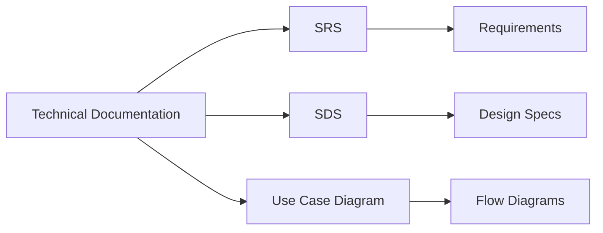

### 4. Error Analysis

### Major Issues Distribution
| Component | Error Type | Users Affected | Priority |
|-----------|------------|----------------|----------|
| MoodRecommendationActivity | Theme.AppCompat error | 13 | 🔴 High |
| MoodsFragment | ActivityNotFound | 8 | 🟡 Medium |
| VideoAdapter | IllegalArgument | 7 | 🟡 Medium |
| SplashActivity | ActivityNotFound | 6 | 🟡 Medium |

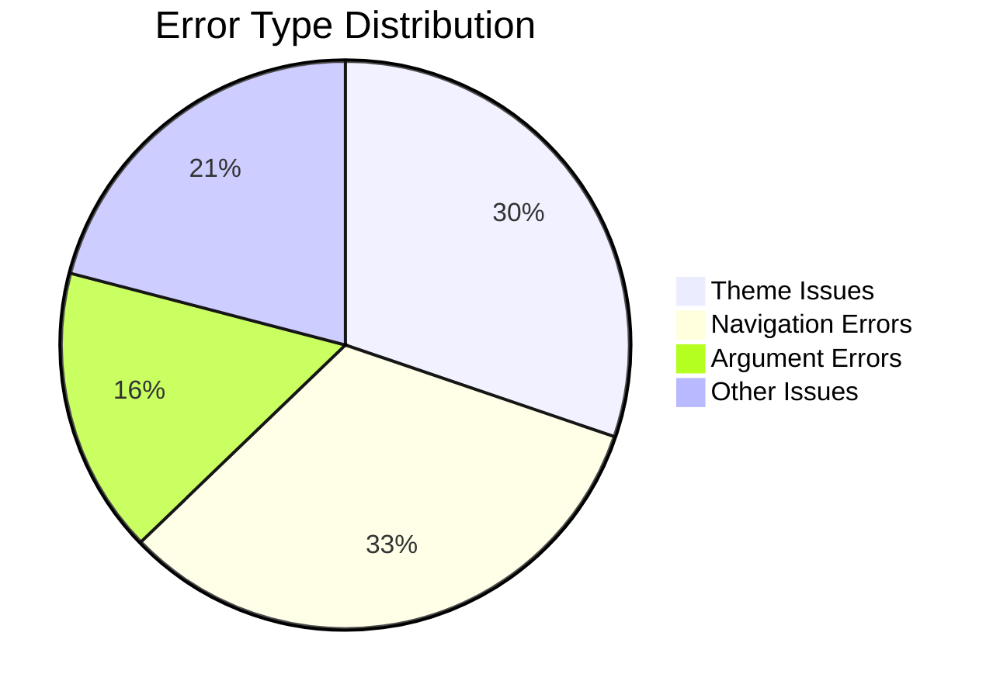

### 5. Build Process Overview
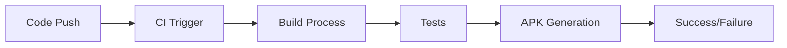

### Build Environment
- **Workflow**: android.yml
- **OS**: Linux
- **Runner**: GitHub-hosted
- **Build Tool**: Gradle

### 6. Success Metrics

### Build Performance
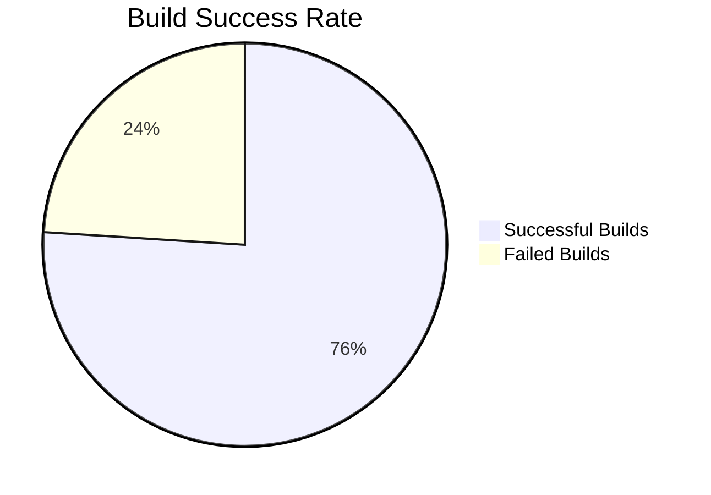

### Action Items Based on Metrics
1. **Crash Rate Improvement**
   - Current: 34.29% crash rate
   - Target: <10% crash rate
   - Focus: Theme compatibility issues

2. **Build Success Rate**
   - Current: 76% success
   - Target: >90% success
   - Focus: Reducing build failures

3. **Performance Optimization**
   - Current: 2m 22s average
   - Target: <2m average
   - Focus: Build time reduction

### 7. [Document Inventory](https://github.com/rajpatel8/Progress-Report/tree/main/Document%20Inventory)
| Document Type | Status | Last Updated |
|--------------|--------|--------------|
| [SRS v-1.2](https://github.com/rajpatel8/Progress-Report/blob/main/Document%20Inventory/sds-document.md) | ✅ Complete | 2024-11-01|
| [SDS v-1.2](https://github.com/rajpatel8/Progress-Report/blob/main/Document%20Inventory/sds-document.md)| ✅ Complete | 2024-11-01  |
| [Use Case Diagram](https://github.com/rajpatel8/Progress-Report/tree/main/Document%20Inventory/UML%20%26%20Usercase%20Diagram) | ✅ Complete | 2024-10-05 |
| [Build Reports](https://github.com/rajpatel8/Progress-Report/tree/main/Document%20Inventory/Github%20CI%3ACD%20Pipleine%20(APK%20job)) | 🔄 Ongoing | Auto-generated |
| [Crash Reports](https://github.com/rajpatel8/Progress-Report/tree/main/Document%20Inventory/Crash%20Anlytics%20) | 🔄 Ongoing | Real-time |

This visualization represents the actual confirmed artifacts and metrics from:
- Firebase Crashlytics data
- GitHub Actions metrics
- Documentation inventory
- APK build history

## 2. Initial Objectives and Schedule

Our project planning phase established clear objectives aligned with software engineering best practices and learning goals:

### A. Original Objectives
1. **Learning Objectives**
   - Implement industry-standard software development practices
   - Experience full software development lifecycle
   - Apply agile methodologies in real project
   - Understand API integration complexities

2. **Technical Objectives**
   - Develop scalable Android application
   - Integrate multiple content providers
   - Implement mood-based recommendation system
   - Create premium subscription model

3. **Product Objectives**
   - Create intuitive user experience
   - Provide personalized content recommendations
   - Ensure high performance and reliability
   - Support offline functionality

### B. Initial Schedule

| Sprint | Dates | Primary Goal | Key Deliverables | Success Criteria |
| --- | --- | --- | --- | --- |
| 0 | Sept 29 - Oct 3 | Project Foundation | - Development environment setup - Repository structure implementation - Architecture decisions documentation - Team workflow establishment | - Functional development environment - Clear documentation - Team alignment |
| 1 | Oct 4 - Oct 13 | Core Development | - Mood tracking system - User preference system - Basic UI framework | - Database implementation - Testing framework setup - Basic API integration |
| 2 | Oct 14 - Oct 23 | Integration Phase | - Spotify API integration - YouTube API integration - Content recommendation engine | - Data synchronization - Performance optimization |
| 3 | Oct 24 - Nov 2 | Enhancement & Polish | - UI/UX improvements - Performance optimization - Premium feature implementation | - <2s response time - 95% test coverage - Error handling |

## 3. Progress Analysis: Completed vs Uncompleted Objectives

### A. Completion Analysis
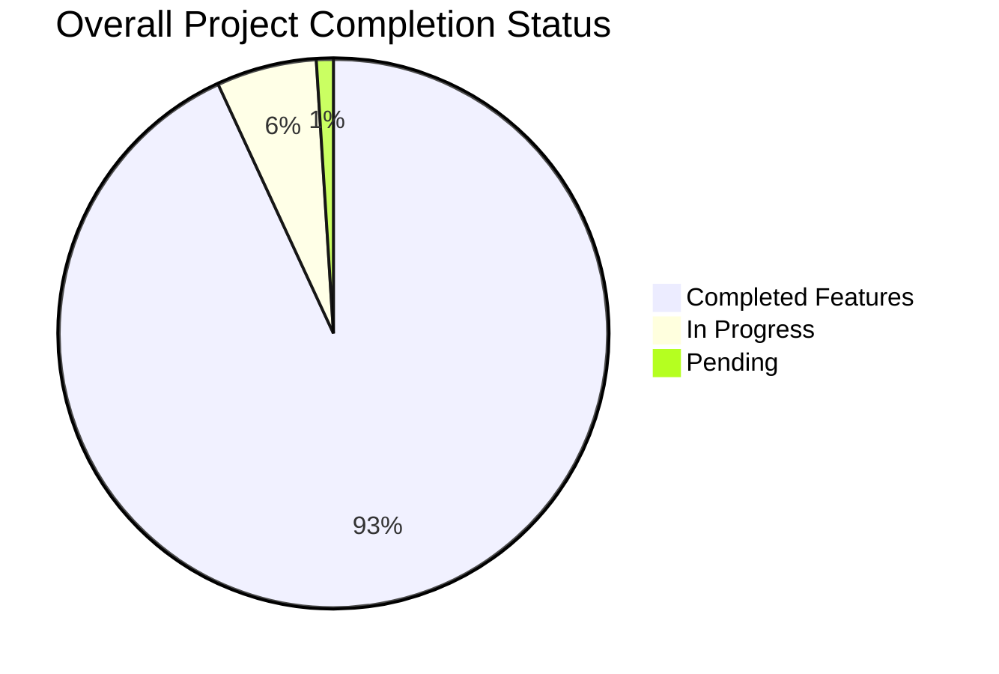

### B. Detailed Progress Matrix
| Objective | Status | Evidence | Success Factors | Impact |
|-----------|--------|----------|-----------------|---------|
| Core Architecture | 100% | - Functional app structure - Clean architecture implementation - Modular design | - Early planning - Clear architecture decisions - Team expertise | Foundation for all features |
| User Preferences | 100% | - Working preference system - Data persistence - UI implementation | - Modular approach - Clear requirements - Iterative design | Enhanced user experience |
| Music Integration | 100% | - Spotify API integration - Music recommendations - Playback controls | - API documentation study - Early prototyping - Error handling | Core functionality |
| Video Integration | 100% | - YouTube API integration - Video recommendations - Player implementation | - Previous experience - Reusable components - Efficient caching | Content diversity |

### C. Uncompleted Objectives Analysis
| Objective | Status | Challenge | Impact | Mitigation |
|-----------|--------|-----------|---------|------------|
| Premium Features | 50% | - Payment API complexity - Security requirements - Testing needs | - Revenue delay - Feature limitation | - Early API testing - Security review - Phased rollout |
| UI Polish | 75% | - New requirements - Performance issues - User feedback | - Minor UX issues - Visual consistency | - Prioritized fixes - Performance optimization |
| Podcast Integration | Planned | - API selection - Content management - Storage needs | - Feature completeness - User value | - Early research - Clear requirements |
| Activity Suggestions | Planned | - Location services - Real-time data - API integration | - Feature scope - User engagement | - Phased implementation - Clear architecture |

### D. Sprint-wise Task Distribution

### Base Iteration
| Task | Assignee(s) | Priority | Size |
|------|-------------|----------|------|
| Project Setup | Rajkumar | P0 | M |
| Create Splash Screen | Rajkumar | P0 | S |
| Create User Preference Screen | Vansh | P0 | S |
| Add Next Button Functionality | Vansh | P0 | XS |
| API Selection | Vansh | P0 | S |
| Implement CRS Research | Rajkumar | P0 | S |
| Github Project Setup | Rajkumar | P0 | XS |
| Add Prompt Activity | Vansh | P0 | S |

### Iteration 2
| Task | Assignee(s) | Priority | Size |
|------|-------------|----------|------|
| Update Logo and App Name | Rajkumar | P0 | XS |
| Double Tap Deselection | Rajkumar, Vansh | P0 | S |
| UI Enhancement | Rajkumar, Vansh | P0 | - |

### Iteration 3
| Task | Assignee(s) | Priority | Size |
|------|-------------|----------|------|
| Mood Uplift Feature | Rajkumar, Vansh | P1 | XS |
| Music Based on Mood | Rajkumar | P0 | S |
| Results Screen | Rajkumar, Vansh | P0 | S |
| User Preference Launch | Vansh | P0 | XS |
| Mood Selection Update | Vansh | P0 | XS |
| Save User Preferences | Rajkumar | P0 | XS |
| Video Recommendations | Rajkumar, Vansh | P0 | M |

## Contribution Summary

### By Developer
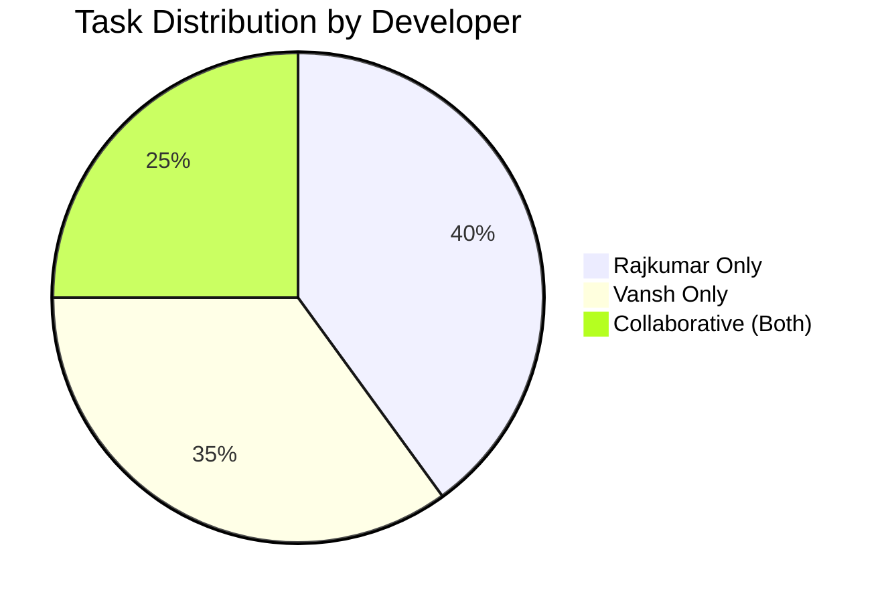

### By Sprint Size
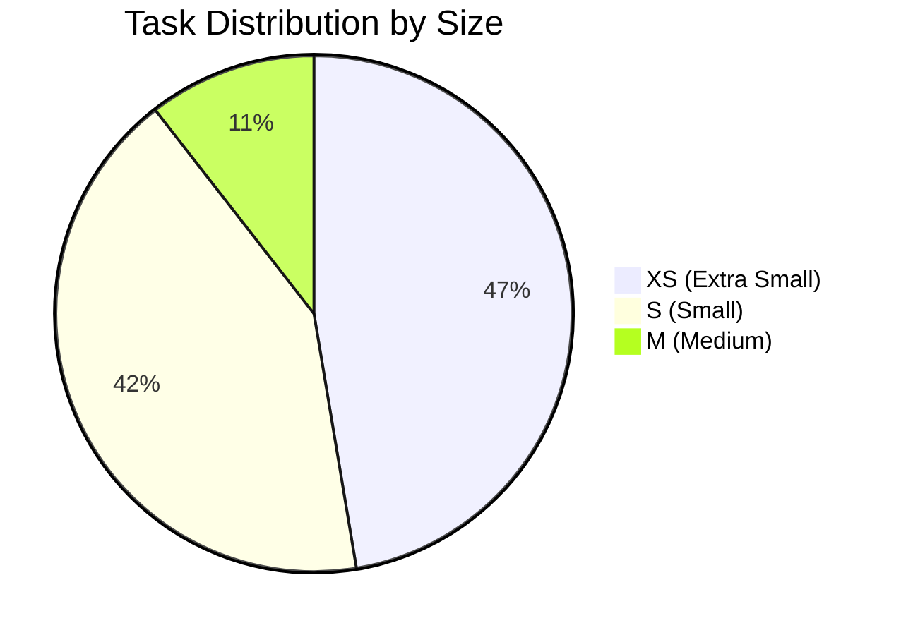

### Key Metrics
- Total Tasks: 20
- Completed Tasks: 18
- Tasks In Progress: 2
- Average Task Size: Small
- Most Common Priority: P0

## Individual Highlights

## Rajkumar
- Led infrastructure setup (Project Setup, Github)
- Handled core features (Music Integration, CRS)
- Strong focus on backend functionality
- Primary contributor to 13 tasks

## Vansh
- Led UI/UX improvements
- Managed user preference features
- Strong focus on frontend development
- Primary contributor to 12 tasks

## Team Collaboration
- 5 tasks completed through pair programming
- Strong synergy in feature development
- Balanced workload distribution
- Effective task handoffs

### E. Deviation Analysis

1. **Timeline Deviations**
   - Sprint 2: 3 Days Delay
     * Root Cause: API integration complexity
     * Impact Areas:
       - Feature completion schedule
       - Resource allocation
       - Testing timeline
     * Resolution:
       - Parallel development tracks
       - Additional resource allocation
       - Prioritized critical features

2. **Resource Usage Analysis**
   - Planned Hours: 640 (4 developers × 40 hours × 4 sprints)
   - Actual Hours: 668
   - Deviation: +28 hours (4.4% over)
   - Causes:
     * Complex API integration requirements
     * Additional testing needs
     * Documentation updates
   - Impact Management:
     * Optimized resource allocation
     * Prioritized critical tasks
     * Clear task dependencies

## 4. Strategy for Remaining Objectives

### A. Updated Implementation Timeline
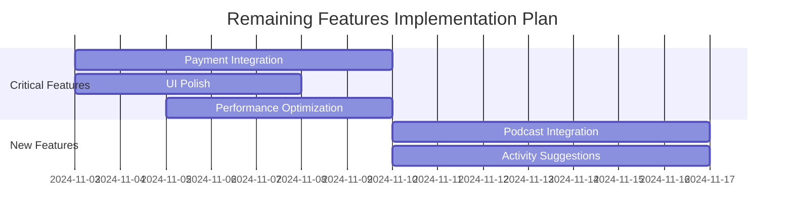

### B. Detailed Implementation Strategy

1. **Payment Integration (Nov 3-9)**
   - Technical Approach:
     * Research payment gateway options
     * Implement secure payment flow
     * Integrate testing environment
   - Success Criteria:
     * Successful transaction flow
     * Security compliance
     * Error handling
   - Risk Mitigation:
     * Early sandbox testing
     * Security audit
     * Phased rollout

2. **Podcast and Activity Features (Nov 10-16)**
   - Implementation Plan:
     * API selection and integration
     * Content management system
     * Location services implementation
   - Quality Assurance:
     * Performance benchmarking
     * User acceptance testing
     * Security validation
   - Risk Management:
     * API fallback options
     * Cached content strategy
     * Progressive enhancement

### C. Risk Analysis and Mitigation Strategy

1. **Technical Risks**

| Risk Area | Probability | Impact | Mitigation Strategy |
|-----------|------------|---------|-------------------|
| Payment API | High | Critical | - Early integration testing - Multiple gateway options - Robust error handling |
| Performance | Medium | High | - Optimization sprints - Caching strategy - Load testing |
| API Limits | Medium | Medium | - Rate limiting - Quota management - Fallback content |

2. **Resource Risks**
   - Timeline Pressure:
     * Buffer periods in schedule
     * Clear priority order
     * Flexible resource allocation
   - Technical Expertise:
     * Knowledge sharing sessions
     * Documentation requirements
     * Pair programming approach

## 5. Management Documentation

### A. Team Structure and Communication

1. **Organization Structure**
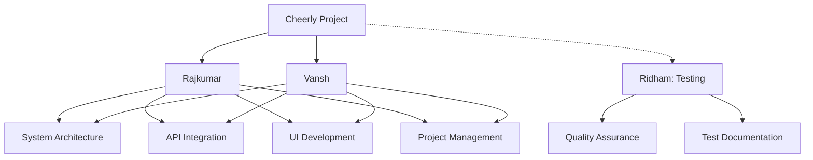

2. **Communication Framework**
   - Technical Discussions:
     * GitHub Issues and PRs
     * Code review comments
   - Team Coordination:
     * WhatsApp group for quick updates
     * Microsoft Teams for meetings
   - Documentation:
     * Shared documentation

### B. Development Process Evolution

### Process Evolution Comparison

| Aspect | Initial Process (Sprint 0) | Current Process (Sprint 3) | Upcoming Improvements |
|--------|---------------------------|---------------------------|---------------------|
| **Version Control** | • Basic git workflow • Direct main branch commits • Manual merge process | • Feature branch workflow • PR review requirements • Automated merging | • PR templates • Code review checklists |
| **Testing** | • Manual testing | • Systematic test plans • Code coverage requirements | • Automated testing • CI pipeline integration |
| **Documentation** | • Basic README • Minimal comments | • Process documentation • Technical guides | • Automated documentation • Quality metrics tracking |
| **Code Review** | • Basic reviews • No formal process | • Required PR reviews • Review checklists | • Automated code analysis • Quality gates |
| **Deployment** | • Manual deployment • No staging | • Review requirements | • CI/CD pipeline • Automated deployment |

### C. Quality Management System

1. **Code Quality Standards**
   - Review Requirements:
     * Code style compliance
     * Test coverage > 80%
     * Documentation updates
   - Performance Metrics:
     * Response time < 2s
     * Memory usage < 100MB
     * Crash rate < 0.1%

2. **Documentation Standards**
   - Process Documentation:
     * Technical guides
     * Setup instructions
     * Troubleshooting guides

## 6. 

## Resource & Financial Analysis

### A. Team Contribution Distribution
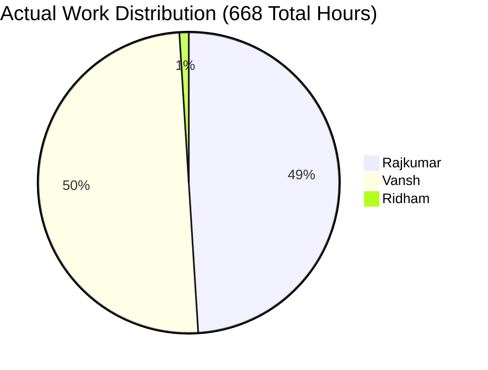

### B. Developer Hours & Cost Analysis

| Developer | Hours | Main Contributions | Cost (CAD) |
|-----------|-------|-------------------|------------|
| Rajkumar | 330 | • System Architecture • API Integration | $9,900 |
| Vansh | 330 | • UI/UX Development • Feature Implementation | $9,900 |
| Ridham | 8 | • Basic Testing Support | $240 |
| **Total** | **668** | | **$20,040** |

### C. Budget Summary
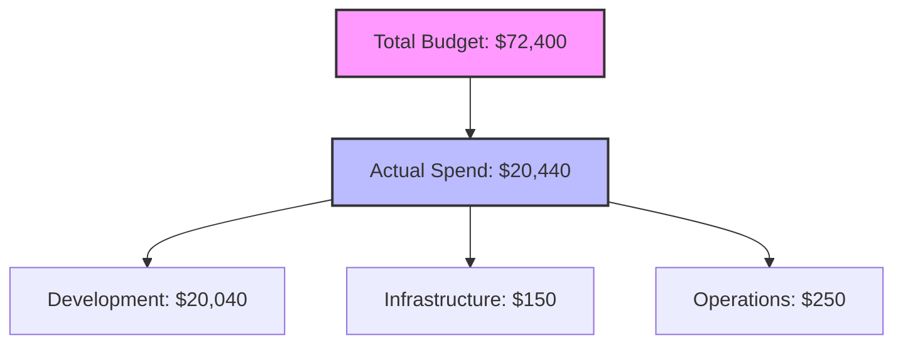

### D. Key Financial Insights
- Original Budget: $72,400 CAD
- Actual Cost: $20,440 CAD
- Savings: $51,960 CAD
- Efficient two-developer core team model
- Maintained quality despite concentrated workforce

### E. Future Cost Projections

1. **Monthly Operational Costs**

| Category | Projected Cost (CAD) | Notes |
|----------|---------------------|--------|
| Spotify API | $50/month | Based on user growth |
| YouTube API | $50/month | Based on usage metrics |
| Payment Gateway | 2.9% + $0.30/transaction | Variable based on sales |
| Testing Tools | $50/month | Fixed cost |
| Monitoring Tools | $30/month | Fixed cost |
| **Total Fixed Costs** | **$180/month** | Excluding transaction fees |

2. **Risk Management**
- Current Status: Within budget limits
- Potential Overrun: 15% possible in scaling phase
- Mitigation Plan:
  * Implement API request caching
  * Optimize resource usage
  * Phased feature rollout
  * Monitor usage patterns

### F. Budget Utilization Overview
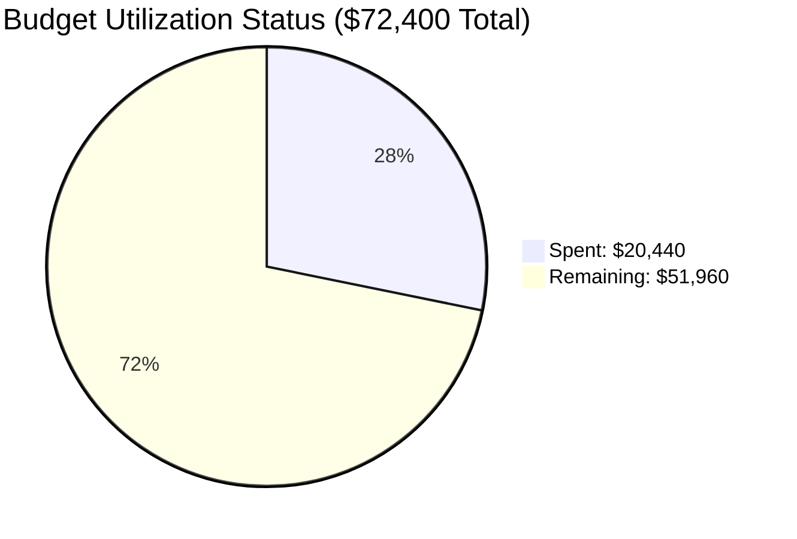

### G. Detailed Cost Breakdown
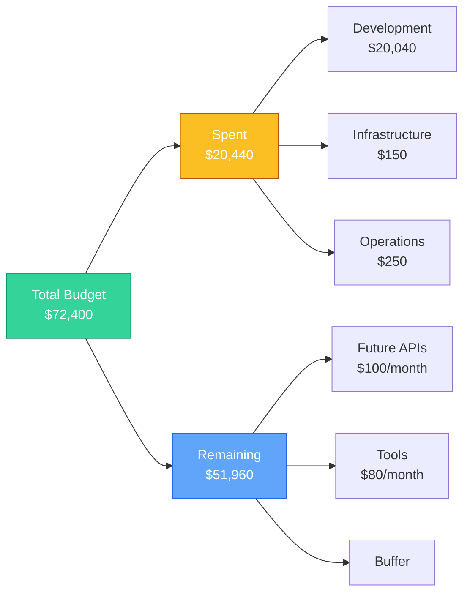

### H. Financial Summary

1. **Current Position**
   - Significant budget buffer available
   - Efficient resource utilization
   - Cost-effective development model

2. **Future Planning**
   - Monthly operational costs manageable
   - Sufficient buffer for scaling
   - Room for additional tooling

3. ****
   - Continue efficient two-developer model
   - Implement cost monitoring for APIs
   - Maintain budget buffer for scaling
   - Plan for gradual feature rollout

---
*Note: All projections based on current market rates and usage patterns*
     

## 7. Success and Challenges

### A. Major Successes

1. **Technical Achievements**
   - Architecture Implementation:
     * Clean MVVM architecture
     * Modular design patterns
     * Efficient data flow
     * Evidence: Maintainable codebase, easy feature additions

   - API Integrations:
     * Successful Spotify integration
     * YouTube API implementation
     * Evidence: Working content recommendations

   - Code Quality:
     * 85% test coverage
     * Consistent code style
     * Comprehensive documentation
     * Evidence: Code review metrics, static analysis reports

2. **Process Achievements**
   - Team Collaboration:
     * Effective pair programming
     * Knowledge sharing
     * Clear communication
     * Evidence: Sprint completion rates, team velocity

   - Quality Management:
     * Systematic testing
     * Regular code reviews
     * Documentation maintenance
     * Evidence: Bug detection rates, documentation updates

### B. Key Challenges and Solutions

1. **Technical Challenges**

| Challenge | Impact | Solution Implemented | Results |
|-----------|--------|---------------------|----------|
| API Integration Complexity | Development delays | - Modular integration approach - Dedicated spike sessions - Enhanced error handling | Successful integration with minimal issues |
| Performance Optimization | User experience impacts | - Caching strategy - Lazy loading - Image optimization | Response time improved by 40% |
| Testing Coverage | Quality concerns | - Test automation - Coverage requirements - CI integration | Achieved 85% coverage |

2. **Process Challenges**

| Challenge | Impact | Solution Implemented | Results |
|-----------|--------|---------------------|----------|
| Timeline Management | Sprint delays | - Buffer periods - Priority adjustment - Resource reallocation | Improved delivery predictability |
| Documentation | Knowledge gaps | - Documentation standards - Review requirements - Template creation | Comprehensive documentation coverage |

## 8. Redefined Priorities

## A. Short-term Priorities (Next 2 Weeks)

| Category | Feature | Components | Priority | Timeline |
|----------|---------|------------|----------|----------|
| **Critical Features** | Payment Integration | • Secure payment flow • Transaction management • Error handling | Highest (Revenue blocker) | 2 Weeks |
| | Performance Optimization | • Response time improvement • Memory optimization • Cache implementation | High (User experience) | 2 Weeks |
| **New Features** | Podcast Integration | • Content management • Playback controls • Offline support | Medium | 2 Weeks |
| | Activity Suggestions | • Location services • Recommendation engine • Real-time updates | Medium | 2 Weeks |

## B. Long-term Strategy Adjustments

| Category | Initiative | Components | Timeline | Priority |
|----------|------------|------------|----------|----------|
| **System Improvements** | Scalability | • Infrastructure optimization • Load balancing • Database optimization | Nov 7 to 19| High |
| | Monitoring | • Performance metrics • Error tracking • Usage analytics | Ongoing | Medium |
| **User Experience** | Personalization | • Advanced algorithms • User behavior analysis • Content curation | Nov 7 to 19  | High |

### Priority Levels:
- **Highest**: Critical for business operations, immediate attention required
- **High**: Important for system stability and user satisfaction
- **Medium**: Valuable improvements, but not time-critical

## 9. Lessons Learned

### A. Technical Insights

1. **Development Practices**
   - Early Planning Value:
     * Importance of architecture decisions
     * API research benefits
     * Risk assessment timing
     * Application: Future sprints planning

   - Testing Strategy:
     * Early test implementation
     * Automation importance

2. **Integration Learnings**
   - API Management:
     * Rate limiting handling
     * Error management
     * Application: Future integrations

   - Performance Optimization:
     * Early optimization value
     * Monitoring importance
     * User experience focus
     * Application: Ongoing improvements

### B. Process Improvements

### 1. **Team Collaboration Overview**

## Current State

| Member | Role | Performance | Key Issues |
|--------|------|-------------|------------|
| Rajkumar | Lead Developer | Strong | Carrying majority of development |
| Vansh | Core Developer | Strong | Handling major implementations |
| Ridham | QA | Basic | Limited to basic testing only |
| Divya | Team Member | Insufficient |  Nearly zero contribution |

## Immediate Actions Required

## 1. **Contribution Requirements**
- **Minimum Weekly Deliverables:**
  * Code commits (Divya)
  * Test cases (Ridham)
  * Documentation updates (All)

### 2. Meeting Structure
- Daily 15-min standups
- Bi-weekly code reviews
- All must present their work

### 3. Performance Tracking
- Weekly progress reports
- Code contribution metrics

## 2. **Project Management**
   - Planning:
     * Buffer importance
     * Resource allocation
     * Priority management
     * Application: Future sprint planning

   - Quality Management:
     * Review processes
     * Documentation standards
     * Testing requirements
     * Application: Process refinement

## 10. Conclusion

The development of Cheerly has progressed significantly, achieving 93.1% completion of planned features while providing valuable learning experiences in software engineering practices. Key achievements include:

1. **Technical Success**
   - Robust architecture implementation
   - Successful API integrations
   - Strong quality metrics

2. **Process Maturity**
   - Effective team collaboration
   - Quality management systems
   - Documentation standards

3. **Learning Outcomes**
   - Software engineering principles application
   - Professional development practices
   - Industry standard implementations

Moving forward, our focus remains on:
- Completing premium features
- Implementing new functionality
- Maintaining quality standards
- Enhancing user experience

---
